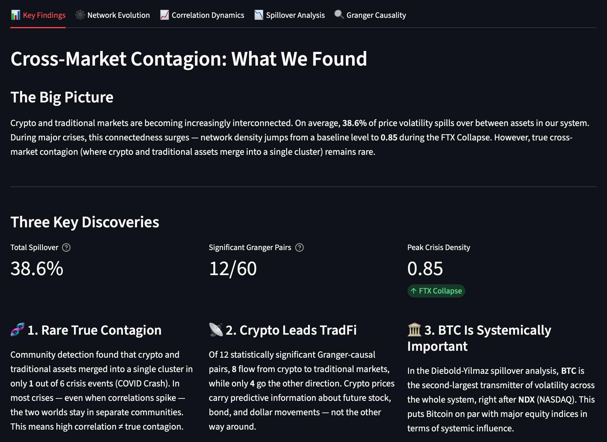
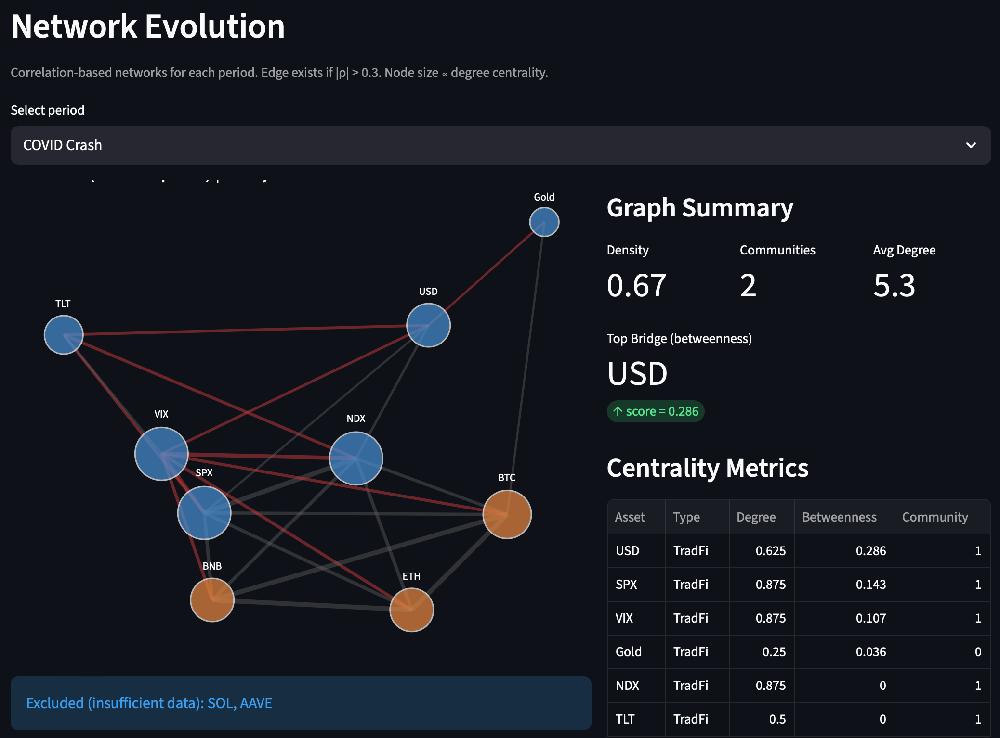
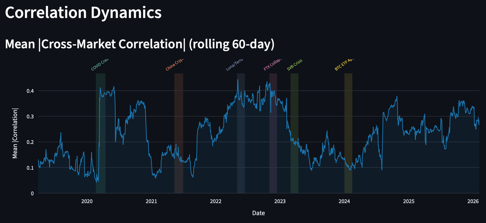

# 🌐 Cross-Market Contagion: Crypto × TradFi

**How do shocks propagate between cryptocurrency and traditional financial markets?**

An interactive research dashboard that uses network analysis, Granger causality, and the Diebold-Yilmaz spillover framework to quantify when, how, and in which direction volatility transmits between crypto and traditional finance.

**[▶ Live Demo](https://crossmarket.streamlit.app)** · **[Methodology](#methodology)**



---

## Key Findings

### 1. 🧬 True contagion is rare
Community detection (Louvain algorithm) reveals that even when correlations spike during crises, crypto and TradFi usually stay in **separate network clusters**. Only the COVID crash (March 2020) produced genuine cross-market contagion — where Gold, BTC, ETH, and BNB merged into a single community. Luna/Terra and FTX, despite network densities of 0.80–0.85, remained crypto-internal events.

### 2. 📡 Crypto leads TradFi — not the other way around
Granger causality tests across 60 directional pairs show that **11 out of 16 significant pairs** flow from crypto → traditional markets. Bitcoin and Ethereum carry predictive information about future S&P 500, NASDAQ, Treasury, and USD movements at 1–5 day lags.

### 3. 🏛️ Bitcoin is systemically important
In the Diebold-Yilmaz spillover decomposition, Bitcoin is the **second-largest net transmitter** of volatility in the entire 11-asset system — right behind NASDAQ. This places BTC on par with major equity indices in terms of systemic influence.

---

## Dashboard

The Streamlit app has 5 interactive tabs:

| Tab | What it shows |
|---|---|
| **Key Findings** | Summary statistics, key discoveries, event timeline |
| **Network Evolution** | Interactive correlation-based graphs with community detection for each crisis |
| **Correlation Dynamics** | Rolling 60-day cross-market correlations with crisis event overlays |
| **Spillover Analysis** | Rolling Diebold-Yilmaz spillover index + directional TO/FROM decomposition |
| **Granger Causality** | Pairwise causality heatmaps showing direction of information flow |

Features:
- **Custom date ranges** — zoom into any period, define your own events
- **Live data updates** — pull latest prices via yfinance with one click
- **Expandable explanations** — toggle between research and overview modes

<details>
<summary>📸 More screenshots</summary>




</details>

---

## Methodology

**Assets analyzed**: 6 TradFi (S&P 500, NASDAQ 100, Gold, US Treasuries, USD Index, VIX) + 5 Crypto (BTC, ETH, SOL, BNB, AAVE) · Daily log returns · Jan 2019 – present

| Method | Purpose | Implementation |
|---|---|---|
| Rolling correlations (60-day) | Track time-varying cross-market dependence | Pairwise rolling Pearson correlation |
| Correlation networks | Visualize market structure | Adjacency matrix with \|ρ\| > 0.3 threshold |
| Louvain community detection | Identify whether crypto/TradFi form separate or merged clusters | `python-louvain` on correlation graphs |
| Granger causality | Determine direction of predictive information flow | Bilateral tests, lags 1–5, ADF-verified stationarity |
| VAR + FEVD | Quantify volatility transmission | VAR(p) with AIC lag selection, 10-day forecast horizon |
| Diebold-Yilmaz spillover index | Measure total and directional connectedness | Generalized FEVD decomposition |

**Crisis events**: COVID Crash (Mar 2020), China Crypto Ban (May 2021), Luna/Terra (May 2022), FTX Collapse (Nov 2022), SVB Crisis (Mar 2023), BTC ETF Approval (Jan 2024)

---

## Quick Start

```bash
# Clone
git clone https://github.com/bolerp/cross-market-contagion.git
cd cross-market-contagion

# Install dependencies
pip install -r requirements.txt

# Download data
python src/data_loader.py

# Launch dashboard
streamlit run app/app.py
```

---

## Project Structure

```
├── app/
│   └── app.py                  # Streamlit dashboard (1200+ lines)
├── notebooks/
│   ├── 02_exploratory_analysis.ipynb
│   ├── 03_network_analysis.ipynb
│   └── 04_econometrics.ipynb
├── src/
│   └── data_loader.py          # Data download & preprocessing
├── data/                       # Price data & returns CSVs
├── docs/screenshots/           # Dashboard screenshots
├── requirements.txt
└── README.md
```

---

## Tech Stack

Python · pandas · NumPy · statsmodels · networkx · python-louvain · plotly · Streamlit · yfinance

---

## Author

**Valerii Kulikovskyi** — MSc Applied Mathematics

- 🔗 [LinkedIn](https://www.linkedin.com/in/valerii-kulikovskyi/)
- 📧 bolerworld@gmail.com

---

## License

MIT
